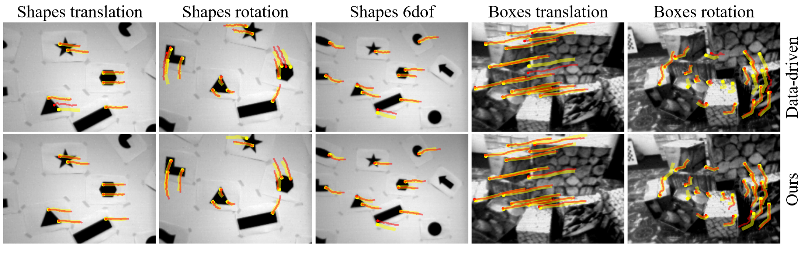

# FF-KDT_eval_on_EC
<p align="center">
  
</p>

The purpose of this repository is to apply the anypoint tracker from FF-KDT on Event Camera dataset. To ensure successful execution, please follow the steps below:

## Environment Setup
   1.1 Complete the environment setup required for testing according to [FF-KDT](https://github.com/yuyangpoi/FF-KDT).  
   
   1.2 The data reading, inference, and metric computation in this code are modified from [Data-driven](https://github.com/uzh-rpg/deep_ev_tracker), so please first set up the environment according to the instructions from that repository.

## Dataset and Pretrained Weights Download
   2.1 Download the processed data from [Google Drive](https://drive.google.com/drive/folders/1xNUgHKqHNJFsU8crSqnn01Nsia4X4Hqf?usp=sharing) 
   
   2.2 Download the pretrained weights from [FF-KDT](https://github.com/yuyangpoi/FF-KDT) and place them in the `FF-KDT_checkpoints/` folder of this project.

## Configuration File
   Adjust `config/eval_real_defaults.yaml` to set the `project_dir` to the current working directory.

## Evaluation
   After completing the above steps, run the following command:
   ```
   bash eval_on_EC.sh
   ```
   This will output the metrics for evaluation.

## References
[1] N. Messikommer, C. Fang, M. Gehrig, and D. Scaramuzza, “Data-driven feature tracking for event cameras,” in Proceedings of the IEEE/CVF Conference on Computer Vision and Pattern Recognition, 2023, pp. 5642–5651.
